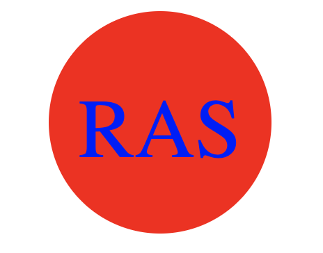

# rasDev-SVG-Logo-Maker

## Description

This is a command-line application that takes user input to generate a logo and save it as an SVG file. This application prompt the user to select color, shape and text for the logo, and save the generated SVG to a .svg file.

## User Story

AS a freelance web developer
I WANT to generate a simple logo for my projects
SO THAT I don't have to pay a graphic designer

## Acceptance Criteria

GIVEN a command-line application that accepts user input
WHEN I am prompted for text
THEN I can enter up to three characters
WHEN I am prompted for the text color
THEN I can enter a color keyword (OR a hexadecimal number)
WHEN I am prompted for a shape
THEN I am presented with a list of shapes to choose from: circle, triangle, and square
WHEN I am prompted for the shape's color
THEN I can enter a color keyword (OR a hexadecimal number)
WHEN I have entered input for all the prompts
THEN an SVG file is created named `logo.svg`
AND the output text "Generated logo.svg" is printed in the command line
WHEN I open the `logo.svg` file in a browser
THEN I am shown a 300x200 pixel image that matches the criteria I entered

## License

MIT License - The License file is provided here : (./LICENSE)

## Screenshot

## Github Repository and Demo Link

Github Repository: https://github.com/rasdevworld/rasDev-SVG-Logo-Maker

Demo Links :

https://app.screencastify.com/v2/manage/videos/pIT3UFnXOvSvpKwrCLak

OR

https://drive.google.com/file/d/1pYWI0MFk3Vw7FYmup70rZIA4BU5smcVf/view

